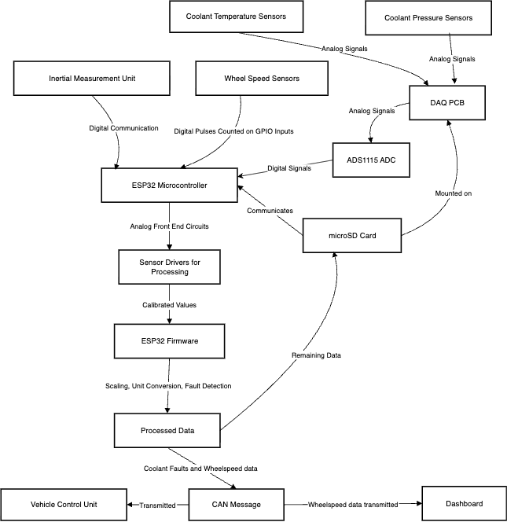

# Data Aquisition System (DAQ)
The DAQ system collect, logs and transmits real-time sensor data from our vehicle to support driver safety, performance analysis, and debugging. The DAQ system interfaces with multiple analog/digital sensors and streams data over CAN to the VCU and other subsystems.  

## Contents 

- [Overview](Overview)
- [System Context](System--Context)
- [Project Status](Project--Status)
- [Hardware](Hardware)
- [Firmware/Software](Firmware/Software)
-  [DAQ additional Information](DAQ--additional--Information)
- [Getting Started](Getting Started)
- [Calibration & Procedures](Calibration&Procedures)
- [Safety & FSAE Compliance](Safety--FSAE--Compliance)
- [Maintainers](Maintainers)
- [License](License)

## Overview
The purpose of the DAQ system is to enable Phantom to **monitor, log, and analyze sensor data** in real time, supporting both driver feedback** and engineering development. It consolidates analog and digital signals (temperatures, pressures, wheel speed) into standardized CAN messages. Logged data is used for post-drive analysis and compliance with Formula SAE rules. 

**Key Features**
- Reads analog and digital sensor signals (wheel speed, two pressure sensors, two temperature sensors, IMU).  
- Communicates over CAN with the VCU and optionally with external loggers.
- Supports data logging for validation, driver feedback, and debugging.  
- Modular firmware for easy addition of new sensors.  

**Design Goals**
- Reliability under track conditions.  
- Easy calibration and debugging.  
- FSAE rule compliance (DAQ required for scrutineering).  
- Expandability for future sensors. 

## System Context

## Project Status

- **Stage:** WIP (currently bench-testing on ESP32, car integration ongoing).
    
- **Current board/major revision:** Rev 4 (ESP32-based DAQ board)
    
- **Last validated on:** <2025‑08‑15>
    
- **Open risks:** 
- CAN bus error handling not yet validated 

## Hardware

- **MCU / ICs:** ESP32, ADS1115 (I^2C), CAN transceiver (SN65HVD230).
    
- **Files:** 
[DAQ Rev 4 Schematic](docs/hardware/Schematic%20PDF_[No%20Variations].pdf)

## Firmware / Software

- **Language/SDK:** C++ with Arduino-ESP32 framework, Python for data visualization.
    
- **Build System:** PlatformIO (VSCode).
    
- **Key Modules:** state machine, CAN, ADC, logic, etc.

## DAQ additional Information
Note:
- The original DAQ project was developed in Python for the Raspberry Pi 4. 
- Due to supply shortages, the project switched to an ESP32 microcontroller. 
- The codebase for the original project can be found in this branch: https://github.com/sfuphantom/DAQ/tree/RaspberryPi-Archive-2021.

## Getting Started

**Prerequisites**
- VSCode with PlatformIO extension installed.  
- To ensure that VSCode recognizes the Arduino include paths, open the `DAQ_FW` folder.

## Calibration & Procedures

## Safety & FSAE Compliance
- **EV.7.1.4** – BMS, IMD, and BSPD must each have independent circuits capable of opening the shutdown system.  
- **EV.4.6** – Series-provided energy meter must monitor TS voltage/current. DAQ supplements this by logging additional sensor data for analysis.  
- **Accumulator monitoring** – At least one temperature sensor required inside the accumulator; DAQ can optionally mirror these values.  
- **Wheel speed (T.11.x)** – Required for scrutineering; DAQ measures and provides wheel speed data to the dashboard and logs for inspection.  
- **Cooling system monitoring** – While not explicitly mandated, DAQ logs coolant pressure/temperature and raises fault signals to the VCU to protect HV components.  

## Maintainers

**Lead:** Sera
**Members:** Andrew, Igor 

**Previous Lead:** Raf
**Previous Members:** Lona, Ethan

## License
Licensed under the [MIT License](./LICENSE).