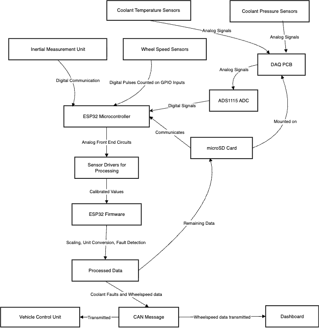

# Data Aquisition System (DAQ)
**Maintainers:** Sera Ermolenko (Project Lead)

The DAQ system collects, logs, displays, and transmits real-time sensor data from the vehicle to support driver safety, performance analysis, and debugging. The current ESP32-based firmware interfaces with analog and digital sensors, streams selected data over CAN to the VCU and dashboard, and sends telemetry/logging data over UART radio and SD card storage.

## Contents 

- [Overview](#overview)
- [System Context](#system-context)
- [Project Status](#project-status)
- [Hardware](#hardware)
- [Firmware / Software](#firmware--software)
- [DAQ Additional Information](#daq-additional-information)
- [Getting Started](#getting-started)
- [PlatformIO Setup](#platformio-setup)
- [Data Preprocessing](#data-preprocessing)
- [Data Visualization](#data-visualization)
- [Antenna Telemetry](#antenna-telemetry)
- [Logic & Functionality](#logic--&--functionality)
- [Configurations & Toggles](#configurations--&--toggles)
- [Calibration & Procedures](#calibration--&--procedures)
- [Additional Notes](#additional-notes)
- [Safety & FSAE Compliance](#safety--fsae-compliance)
- [Maintainers](#maintainers)
- [License](#license)


## Overview
The purpose of the DAQ system is to monitor, log, and analyze sensor data in real time for driver feedback and engineering development. It consolidates analog and digital signals into runtime state, CAN messages, SD CSV logs, and telemetry UART output. The system also computes a cooling fault condition and transmits that status to the VCU.

**Key Features**
- Reads analog and digital sensor signals (4 wheel speed, 2 flow, 2 temperature, 1 steering angle, and 4 suspension).  
- Communicates over CAN with the VCU and Dash.
- Supports telemetry UART output for validation and radio transmission.
- Supports internal SD card data logging for validation, driver feedback, and debugging.  
- Supports sensor simulation for bench validation without attached hardware.
- Modular firmware for easy addition of new sensors.  

**Design Goals**
- Reliability under track conditions.  
- Easy calibration and debugging.  
- FSAE rule compliance (DAQ required for scrutineering).  
- Expandability for future sensors. 

## System Context


## Project Status

- **Current state:** 
- Bench-tested on ESP32 dev kits with CAN, telemetry/logging flow, and task-based runtime. Firmware now supports temperature, pulse-based flow, wheel speed, steering angle, suspension, SD logging, telemetry UART, and sensor simulation. Hardware validation is still required for the latest revision and wiring.

- **Focus areas:** Finalize wiring harness pinout, expand calibration coverage for additional sensors, and document the warm-up/fault behavior for the VCU team. Finlaizing perf board for addtional sensors. 
    
- **Current board/major revision:** Rev 4 (ESP32-based DAQ board)
    
- **Last validated on:** <2025‑11‑18>
    
- **Health:** 
- Sensor bring-up, CAN messaging, and logging are stable; remaining tasks are workflow polish and extended testing. 


## Hardware

- **MCU / ICs:** ESP32, ADS1115 (I^2C), CAN transceiver (SN65HVD230).
    
- **Files:** 
[DAQ Rev 4 Schematic](docs/hardware/Schematic%20PDF_[No%20Variations].pdf)

## Firmware / Software

- **Language/SDK:** C++ with Arduino-ESP32 framework, Python for preprocessing and visualization utilities.
    
- **Build System:** PlatformIO (VS Code or CLI via `pio`).
    
- **Key Modules:** 
| Module | Location | Purpose | Notes |
| --- | --- | --- | --- |
| **Main firmware** | `DAQ_FW/src/main.cpp` | Initializes hardware and starts runtime tasks. | Sets up UART, CAN, SD, sensors, and watchdog. |
| **Runtime scheduler** | `DAQ_FW/lib/Runtime` | Runs FreeRTOS tasks for sensors, logging, CAN, and telemetry. | Controls task rates and mode-dependent behavior. |
| **Sensor service** | `DAQ_FW/lib/Sensors` | Aggregates critical and chassis sensors into the shared snapshot. | Uses shared ADS1115 chip objects for ADC-backed sensors. |
| **IADC Sensor drivers** | `DAQ_FW/lib/IADCSensor` | ADS1115 abstractions for coolant temperature, steering angle, and suspension. | Logical sensors own channels, not ADC chips. |
| **Flow pulse module** | `DAQ_FW/lib/FlowPulse` | Counts Hall-effect flow pulses and converts them to L/min. | Uses GPIO interrupts and a configurable sample window. |
| **Service layer** | `DAQ_FW/lib/Services` | Snapshot state, telemetry CSV, SD logging, and fault handling. | `SnapshotService` uses targeted field updates to avoid task overwrite races. |
| **CAN (TWAI) layer** | `DAQ_FW/lib/CAN` | Configures ESP32 CAN driver and transmits frames. | `CAN_Init()` validates loopback; `CAN_SendInt16()` sends packed integers. |
| **Wheel speed** | `DAQ_FW/lib/WheelSpeed` | Captures interrupts and computes wheel/vehicle speed. | Use `WheelSpeedReset()` + getters in runtime tasks. |
| **Simulation** | `DAQ_FW/lib/Simulation` | Generates fake sensor data for bench validation without hardware. | Drives the same snapshot/logging/telemetry pipeline as real sensors. |
| **Global config** | `DAQ_FW/include/system_config.h` | Shared pins, modes, thresholds, and feature toggles. | Includes telemetry UART and flow constants. |
| **Antenna receiver (PC)** | `antenna/telemetry_receiver.py` | Logs incoming telemetry radio CSV to timestamped files. | Reads serial port at configured baud (`57600`). |

## DAQ additional Information
Note:
- The original DAQ project was developed in Python for the Raspberry Pi 4. 
- Due to supply shortages, the project switched to an ESP32 microcontroller. 
- The codebase for the original project can be found in this branch: https://github.com/sfuphantom/DAQ/tree/RaspberryPi-Archive-2021.

## Getting Started
1. **Clone & Open** – `git clone` the repo, open it in VS Code or your preferred editor/terminal.
2. **Install Dependencies** – PlatformIO will pull libraries from `platformio.ini` automatically, or run `pio pkg install`.
3. **Review Config** – Configure modes, sensor toggles, limits, and telemetry settings in `DAQ_FW/include/system_config.h`.
4. **Build** – `pio run` (targets `[env:esp32dev]` by default).
5. **Flash** – `pio run -t upload` with the ESP32 connected over USB.
6. **Monitor** – `pio device monitor -b 115200` to view logs (`Logger::Notice/Trace/Error` output status and snapshots).
7. **Verify Bench Behavior** – Confirm SD init, UART telemetry init, and expected mode behavior (`MODE_FULL`, `MODE_CAN_ONLY`, or `MODE_SENSORS_ONLY`).
8. **Optional No-Hardware Validation** – Set `ENABLE_SENSOR_SIMULATION = 1` in `DAQ_FW/include/system_config.h` and test telemetry / SD outputs without attached sensors.
9. **Telemetry Receiver (PC)** – Run `python3 antenna/telemetry_receiver.py --port <PORT> --baud 57600` to capture radio telemetry CSV logs.

## PlatformIO Setup 
```
pip install platformio          # or install the VS Code PlatformIO IDE extension
pio run                         # build
pio run -t upload               # flash
pio device monitor -b 115200    # serial monitor (matches BAUD_RATE)
```
- Environment: `[env:esp32dev]` in `platformio.ini`.
- Dependencies: ArduinoLog, Adafruit ADS1X15, SPI, LSM6DS, Unified Sensor (auto-resolved by PlatformIO).
- Serial monitor uses the baud defined in `include/system_config.h` (`BAUD_RATE = 115200`).

**Prerequisites**
- ESP32 dev board wired to ADS1115 modules, coolant sensors, wheel-speed sensors, flow pulse inputs, and CAN transceiver (TX = GPIO4, RX = GPIO5).
- PlatformIO Core (`pip install platformio`) or VS Code with the PlatformIO IDE extension.
- USB cable for flashing and serial monitoring.
- Access to the vehicle CAN bus or a bench CAN interface for testing.

## Data Preprocessing
- Location: `daq_data_preprocessing/preprocessing.py`
- Purpose: takes CSV logs from SD card `unprocessed/`, normalizes timeline, filters outliers, fills short gaps, and writes cleaned files into the processed directory.

Run:
```bash
python3 daq_data_preprocessing/preprocessing.py /path/to/SD
```

Notes:
- Requires `DRIVE_ROOT` in `daq_local_config.py`.
- Expects source logs at `<SD>/unprocessed`.
- Moves original CSV files to `processed/raw` after processing.

## Data Visualization
- Location: `daq_data_visualization/visualization.py`
- Purpose: generates run summaries and plots (speed, flow, temperature, suspension, correlation heatmaps) from processed CSV files.

Run with real processed data:
```bash
python3 daq_data_visualization/visualization.py
```

Run with simulated data:
```bash
python3 daq_data_visualization/visualization.py --simulate
```

Notes:
- Uses `daq_data_visualization/sim_test.py` for simulation mode.
- Writes outputs under `processed/plots` and `processed/summaries` (or `daq_data_visualization/test_data` in simulation mode).

## Antenna Telemetry
- Location: `antenna/telemetry_receiver.py`
- Purpose: receives telemetry CSV over serial from the 915 MHz telemetry radio link and saves timestamped log files.

Install dependency:
```bash
pip install pyserial
```

Run:
```bash
python3 antenna/telemetry_receiver.py --port COM7 --baud 57600
```

Notes:
- Default output directory: `antenna/logs`.
- Telemetry CSV format currently includes:
  `timestamp_ms,temp1_c,temp2_c,flow1_lpm,flow2_lpm,susp1,susp2,susp3,susp4,steering_angle_deg,speed_kmh`
- For firmware-side streaming, use `SYSTEM_MODE = MODE_FULL`.


## Logic & Functionality
1. **Setup Path (`DAQ_FW/src/main.cpp`)**
   - Starts Serial, I2C, SPI, logger, SD logging, telemetry UART, and CAN (when enabled by mode/flags).
   - Initializes enabled real sensors through `SensorService_Init()` when simulation is off.
   - Initializes fault service and starts FreeRTOS tasks via `Runtime_StartTasks()`.
   - Sends a startup cooling fault status frame (`CoolingFault = 0`) when CAN is enabled.

2. **Task-Based Runtime (`DAQ_FW/lib/Runtime/TaskScheduler.cpp`)**
   - `CriticalSensorsTask` reads temperature/flow sensors and evaluates fault state.
   - `WheelSpeedTask` updates wheel speed values and transmits CAN wheel speed when enabled.
   - `ChassisSensorsTask` reads suspension and steering channels.
   - `LoggerTask` prints snapshots and appends SD logs when enabled.
   - `TelemetryTask` streams CSV snapshots over telemetry UART when enabled.
   - `SimulatedSensorsTask` can replace the real sensor tasks with generated data.

3. **Fault Behavior (`DAQ_FW/lib/Services/FaultService.cpp`)**
   - Uses warm-up suppression and debounce timers before asserting a fault.
   - Checks flow and temperature against configured min/max bounds.
   - Transmits `CoolingFault` CAN status (`0`/`1`) when CAN is enabled.

4. **Shared Snapshot Model (`DAQ_FW/lib/Services/SnapshotService.cpp`)**
   - Producer tasks update only the fields they own instead of overwriting the entire snapshot.
   - Logging, SD logging, and telemetry consume the shared latest-value state.

## Configurations & Toggles 
(in `DAQ_FW/include/system_config.h`)
- `SYSTEM_MODE` (`MODE_FULL`, `MODE_CAN_ONLY`, `MODE_SENSORS_ONLY`) controls which subsystems run.
- `ENABLE_SENSOR_SIMULATION` swaps real sensor acquisition for generated data.
- `ENABLE_TELEMETRY_OUTPUT` and `ENABLE_SD_LOGGING_OUTPUT` allow antenna and SD validation independently.
- Sensor toggles (`ENABLE_TEMP_SENSOR_*`, `ENABLE_FLOW_SENSOR_*`, `ENABLE_SUSP_SENSOR_*`, `ENABLE_WHEEL_SPEED_SENSORS`) control active channels.
- Safety bounds (`MAX_TEMP_1`, `MAX_TEMP_2`, `MIN_TEMP`, `MIN_FLOW_LPM`, `MAX_FLOW_LPM`) define fault thresholds.
- Telemetry settings (`TELEMETRY_UART`, `TELEMETRY_TX_PIN`, `TELEMETRY_RX_PIN`, `TELEMETRY_BAUD`, `TELEMETRY_PERIOD_MS`) configure the radio serial link.
- Flow conversion constants (`FLOW_SENSOR_HZ_PER_LPM`, `FLOW_SENSOR_SAMPLE_WINDOW_MS`, `FLOW_SENSOR_*_PIN`) tune pulse-based flow-rate math.
- CAN pins and message IDs (`CAN_TX_PIN`, `CAN_RX_PIN`, `CANMessageId`) should only be changed in sync with VCU expectations.

> Keep `system_config.h` aligned with the actual harness wiring and calibration sheet before flashing.

## Calibration & Procedures
1. **Sensor Verification**
   - Enable one channel at a time with `ENABLE_*` toggles.
   - Use `pio device monitor -b 115200` to confirm stable values and no ADC init errors.
   - Tune `MAX_TEMP_*` and `MIN/MAX_FLOW_LPM` against trusted references.
   - For flow sensors, verify pulse polarity, pull-up voltage, and `FLOW_SENSOR_HZ_PER_LPM` against the actual sensor.

2. **Warm-Up Buffer Check**
   - With cold sensors, boot DAQ and confirm no immediate fault assertion during warm-up.
   - After warm-up, force a known out-of-range value and confirm `CoolingFault` transitions high.
   - Restore normal conditions and confirm fault clears.

3. **Wheel-Speed Validation**
   - Spin wheel inputs manually and verify wheel speed values update and CAN wheel-speed messages transmit when enabled.

4. **Telemetry Radio Validation**
   - Set `SYSTEM_MODE` to `MODE_FULL` and run `antenna/telemetry_receiver.py` on the PC.
   - Confirm steady CSV reception at expected rate (`TELEMETRY_PERIOD_MS`), with valid field count and timestamps.
   - Verify radio link quality at increasing distance before dynamic testing.

5. **No-Hardware Validation**
   - Set `ENABLE_SENSOR_SIMULATION = 1`.
   - Use `ENABLE_TELEMETRY_OUTPUT` / `ENABLE_SD_LOGGING_OUTPUT` to test antenna-only, SD-only, or both.
   - Validate console logs, CSV formatting, CAN behavior, and fault transitions without attached sensors.

6. **In-Car Procedure**
   - Ensure coolant is circulating before enabling strict fault thresholds.
   - Coordinate expected CAN IDs and startup behavior with VCU/dash teams.
   - Record both SD and radio telemetry for first integration runs.

## Additional Notes
- For antenna-only or SD-only bench tests, use `ENABLE_TELEMETRY_OUTPUT` / `ENABLE_SD_LOGGING_OUTPUT` in addition to `SYSTEM_MODE`.
- Flow sensing is now pulse-based via GPIO interrupts, not ADC voltage-to-frequency conversion.
- When adding sensors, extend `SensorService`, `SnapshotService`, logging/telemetry serializers, and visualization schema together.
- Share wiring and calibration updates with the team so this README and config remain accurate.

## Safety & FSAE Compliance
- **EV.7.1.4** – BMS, IMD, and BSPD must each have independent circuits capable of opening the shutdown system.  
- **EV.4.6** – Series-provided energy meter must monitor TS voltage/current. DAQ supplements this by logging additional sensor data for analysis.  
- **Accumulator monitoring** – At least one temperature sensor required inside the accumulator; DAQ can optionally mirror these values.  
- **Wheel speed (T.11.x)** – Required for scrutineering; DAQ measures and provides wheel speed data to the dashboard and logs for inspection.  
- **Cooling system monitoring** – While not explicitly mandated, DAQ logs coolant flow/temperature and raises fault signals to the VCU to protect HV components.  

## Maintainers

**Current Project Lead:** Sera Ermolenko

## Contributors & Credits
- **Sera Ermolenko (2025-2026 major revision):** Authored RTOS/task-based firmware architecture (`Runtime/Services/Sensors`), firmware addtion and testing of 4 suspension sensors, sterring angle sensor, two flow sensors, revision of wheelspeed sensors and temperature sensors, active CAN implementation and integration/testing, telemetry antenna integration, cd card integration, preprocessing pipeline, and visualization pipeline.
- Hardare workaround with perf board. 

**History**
- **Sera:** Coolant and temerature sensors (later re-written and re-placed with flow sensors)
- **Igor:** Hardware re-design.
- **Ritesh:** Hardware design (later rewritten in current revision).
- **Andrew:** Legacy CAN driver implementation and IAD sensor class.
- **Lona:** Earlier wheel-speed implementation (later rewritten in current revision).

## License
Licensed under the [MIT License](./LICENSE).
